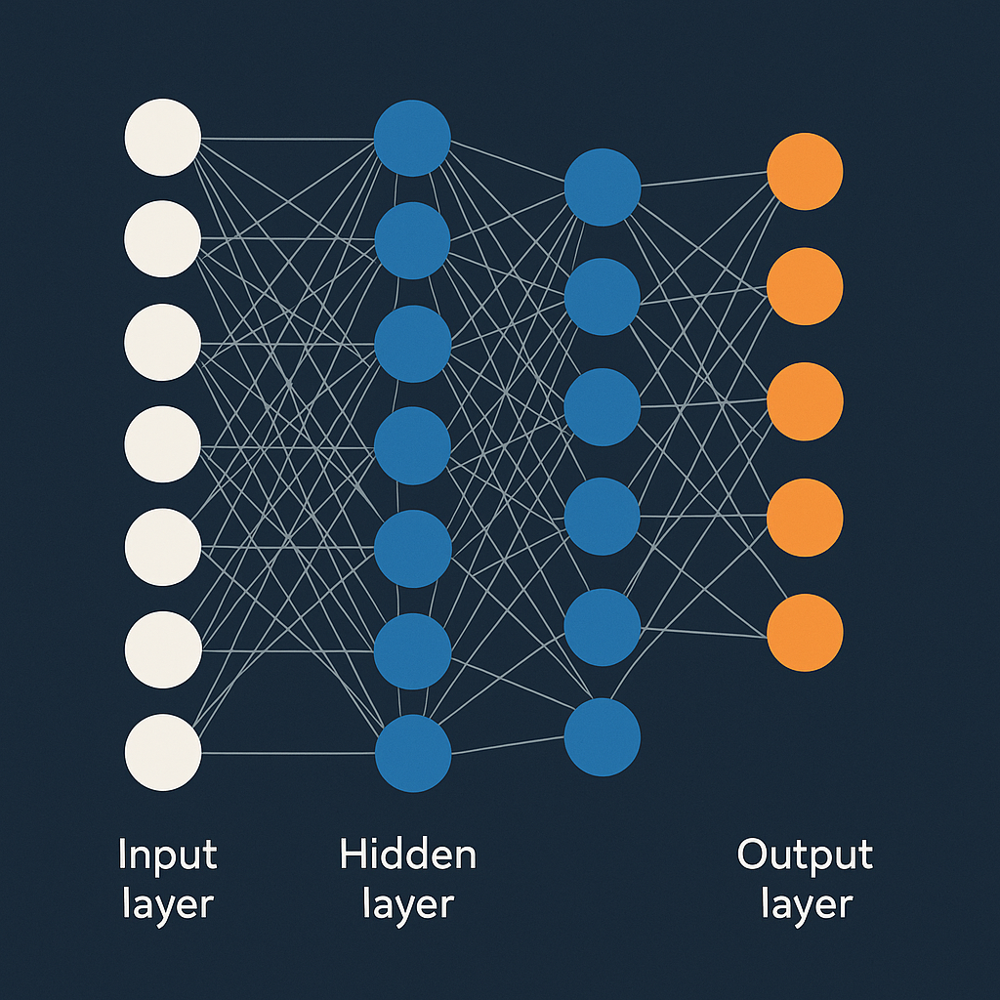

# Artificial Neural Networks (ANN)

Artificial Neural Networks (ANN) are a class of machine learning models inspired by the structure and function of biological neural networks. They consist of layers of interconnected nodes (neurons) that process input data to learn complex patterns and relationships.

## Key Concepts
- **Neurons**: The basic units of an ANN that receive input, apply a weighted sum, and pass the result through an activation function.
- **Layers**: ANNs are composed of an input layer, one or more hidden layers, and an output layer.
- **Weights and Biases**: Parameters that are adjusted during training to minimize the error in predictions.
- **Activation Functions**: Functions that introduce non-linearity into the model, allowing it to learn complex patterns (e.g., ReLU, Sigmoid, Tanh).
- **Backpropagation**: A training algorithm used to update weights and biases by calculating the gradient of the loss function.
- **Loss Function**: A function that measures the difference between the predicted output and the actual output (e.g., Mean Squared Error, Cross-Entropy).

## Step by step of ANN

1. **Data Preparation**: Collect and preprocess the data, including normalization, handling missing values, and splitting into training and testing sets.
2. **Model Architecture**: Define the architecture of the ANN, including the number of layers, number of neurons in each layer, and activation functions.
        - **Network initialization:** Initialize weights and biases for all neurons in the network, typically using random values or specific initialization techniques (e.g., Xavier, He initialization).
        - **Neuron activation function:** Choose appropriate activation functions for each layer (e.g., ReLU for hidden layers, Sigmoid or Softmax for output layer depending on the task). 
3. **Forward Propagation**: Implement the forward pass where input data is passed through the network to generate predictions.
4. **Loss Calculation**: Compute the loss using an appropriate loss function based on the task
5. **Backpropagation**: Calculate the gradients of the loss with respect to weights and biases, and update them using an optimization algorithm (e.g., Stochastic Gradient Descent, Adam).
6. **Training**: Iterate through multiple epochs (how many times the entire training dataset is passed through the network) of forward propagation, loss calculation, and backpropagation to train the model.
7. **Evaluation**: Assess the model's performance on the test set using relevant metrics (e.g., accuracy, precision, recall for classification; RMSE for regression).

## Applications
- Image and speech recognition
- Natural language processing
- Time series forecasting
- Game playing and reinforcement learning
- Medical diagnosis

## ANN for Different Tasks

**a) Binary classification**
ANN can be used for binary classification tasks where the goal is to classify input data into one of two classes. The output layer typically consists of a single neuron with a sigmoid activation function that outputs a probability value between 0 and 1.

**b) Multiclass classification**
For multiclass classification tasks, ANN can be designed with an output layer that has multiple neurons, each representing a different class. A softmax activation function is commonly used in the output layer to convert the raw output scores into probabilities for each class.

**c) Regression**
In regression tasks, ANN can be employed to predict continuous values. The output layer usually consists of a single neuron with a linear activation function, allowing the model to output a wide range of values.

## Implementation
ANNs can be implemented using various deep learning frameworks such as TensorFlow, Keras, and PyTorch. These frameworks provide high-level APIs to build, train, and evaluate neural network models efficiently.

- The notebook `ANN.ipynb` contains practical examples of implementing ANN for binary classification, multiclass classification, and regression tasks using Python and popular deep learning libraries.

