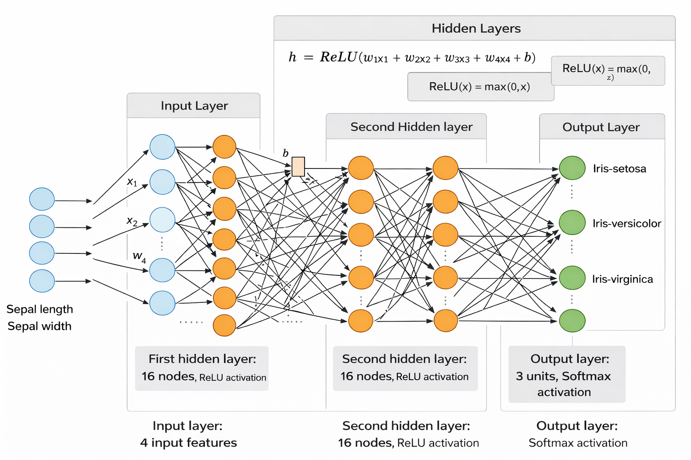

# Deep Neural Network (DNN) and Convolutional Neural Network (CNN) – Learning Summary

- [**PART I — Deep Neural Network (DNN) for Multiclass Classification**](#part-i--deep-neural-network-dnn-for-multiclass-classification)
- [**PART II — Convolutional Neural Networks (CNN) and Transfer Learning with VGG16**](#part-ii--convolutional-neural-networks-cnn-and-transfer-learning-with-vgg16)

# PART I — Deep Neural Network (DNN) for Multiclass Classification

## 1. Objective of the Exercise

The goal of this lab is to design, train, and understand a **Deep Neural Network (DNN)** for a **multiclass classification problem**, using the Iris dataset as a case study. The exercise focuses on both **practical implementation** and **theoretical understanding** of how DNNs process data.

## 2. Dataset and Problem Setup

The Iris dataset consists of:

* **4 numerical input features**:

  * Sepal length
  * Sepal width
  * Petal length
  * Petal width
* **1 target variable (`target`)** representing flower species:

  * 0 → Setosa
  * 1 → Versicolor
  * 2 → Virginica

This is a **supervised learning** and **multiclass classification** problem.

## 3. Feature and Target Separation

The dataset is split into:

* **Features (`X`)**: numerical input variables used by the model
* **Target (`y`)**: categorical class labels

Although the features are already numerical and require no encoding, the target variable represents categories and must be transformed before training a neural network.

## 4. Label Encoding (One-Hot Encoding)

### Why encoding is required

Class labels such as `0`, `1`, and `2` are categorical identifiers, not numerical values with magnitude or order. Using them directly would introduce a false ordinal relationship.

### One-Hot Encoding

Each class is represented as a binary vector:

* 0 → [1, 0, 0]
* 1 → [0, 1, 0]
* 2 → [0, 0, 1]

This representation:

* Removes any implied order between classes
* Is compatible with softmax activation and categorical cross-entropy loss
* Is required for multiclass neural network outputs

The `OneHotEncoder` from `scikit-learn` is used, with:

* `fit_transform()` applied only to training labels
* `transform()` applied to test labels to avoid data leakage

## 5. Why the Encoder Requires a 2D Input

Scikit-learn encoders operate on **feature matrices**, following the convention:

* Rows represent samples
* Columns represent features

Even when encoding a single categorical variable, the input must be reshaped from:

* `(n_samples,)` → `(n_samples, 1)`

This makes the data structure explicit and allows the encoder to operate correctly.

## 6. Feature Normalization

Before training the DNN, input features are normalized. Normalization ensures that:

* All features are on a similar scale
* Gradient descent converges faster
* No feature dominates learning due to magnitude differences

Normalized data is used for both training and validation.

## 7. Feature Dimension (`feature_dim`)

The feature dimension represents the **number of input features per sample**.

```python
feature_dim = X_train_norm.shape[1]
```

This value defines:

* The size of the input layer
* How many inputs each neuron in the first hidden layer receives

For the Iris dataset:

* `feature_dim = 4`

## 8. DNN Architecture Design

The Deep Neural Network is built using a **Sequential** model with the following layers:

### Input Layer

* Defined implicitly through `input_shape=(feature_dim,)`
* Accepts a vector of normalized features



### Hidden Layers

1. **First Hidden Layer**

   * Dense layer with 16 neurons
   * ReLU activation
   * Fully connected to all input features

2. **Dropout Layer**

   * Dropout rate = 0.2
   * Randomly disables 20% of neurons during training
   * Helps prevent overfitting

3. **Second Hidden Layer**

   * Dense layer with 16 neurons
   * ReLU activation

4. **Second Dropout Layer**

   * Dropout rate = 0.2

### Output Layer

* Dense layer with 3 neurons (one per class)
* Softmax activation
* Outputs a probability distribution over classes

## 9. Activation Functions

* **ReLU (Rectified Linear Unit)**
  Introduces non-linearity and enables learning complex patterns.

* **Softmax**
  Converts raw outputs into probabilities that sum to 1, suitable for multiclass classification.

## 10. Model Compilation

The model is compiled with:

* **Optimizer**: Adam (efficient gradient-based optimization)
* **Loss function**: Categorical cross-entropy (appropriate for one-hot encoded multiclass targets)
* **Metric**: Accuracy

## 11. Model Training

The model is trained using:

* **Epochs**: 50
  (Number of complete passes through the training data)
* **Batch size**: 32
  (Number of samples processed before updating weights)
* **Validation split**: 0.3
  (30% of training data used to monitor generalization)

The training process returns a `history` object that stores:

* Training loss and accuracy
* Validation loss and accuracy

## 12. Training Monitoring and Visualization

The training history is used to visualize:

* Accuracy vs. epochs
* Loss vs. epochs

These plots help identify:

* Learning progress
* Convergence behavior
* Overfitting or underfitting

## 13. Key Concepts Learned

* Difference between features and labels
* Importance of label encoding for neural networks
* Role of feature normalization
* Meaning of feature dimension
* Structure and function of DNN layers
* Purpose of dropout regularization
* Relationship between softmax and categorical cross-entropy
* Proper separation of training, validation, and test data

## 14. Conclusion

This lab demonstrates the complete pipeline for building a Deep Neural Network for multiclass classification, combining theoretical understanding with practical implementation. Each preprocessing and architectural choice plays a critical role in ensuring correct learning, numerical stability, and generalization performance.

# **PART II — Convolutional Neural Networks (CNN) and Transfer Learning with VGG16**

## 15. Objective of the Second Exercise

The goal of this exercise is to understand how **Convolutional Neural Networks (CNNs)** process images and how **pretrained CNN models**, such as **VGG16**, can be reused for:

* **Feature extraction**
* **Image classification**

Instead of training a CNN from scratch, this exercise focuses on **transfer learning**, where a model trained on a large dataset (ImageNet) is reused to analyze a new image.

## 16. Pretrained Models and Transfer Learning

### What is a pretrained model?

A pretrained model is a neural network that has already been trained on a large and diverse dataset.
VGG16 was trained on **ImageNet**, which contains **over 1 million images across 1000 classes**.

### Why use a pretrained CNN?

* Reduces training time
* Avoids the need for large datasets
* Leverages rich, general-purpose visual features
* Provides strong performance even on small datasets

## 17. VGG16 Architecture Overview

VGG16 is a **deep convolutional neural network** composed of:

* Multiple **convolutional layers** (3×3 filters)
* **ReLU** activation functions
* **Max pooling layers** for spatial downsampling
* Fully connected layers at the top (classifier)

The model can be split into two conceptual parts:

1. **Feature extractor** (convolutional base)
2. **Classifier** (fully connected layers + softmax)

## 18. Feature Extraction Using VGG16

### Removing the classifier (`include_top=False`)

To use VGG16 purely as a feature extractor, the model is instantiated with:

* `weights="imagenet"`
* `include_top=False`

This configuration removes the final dense layers and keeps only the convolutional base.

The output of the feature extractor is a **high-dimensional feature map** that encodes visual patterns such as:

* Edges
* Textures
* Shapes
* Object parts

## 19. Input Image Preparation

Before passing an image to VGG16, it must be prepared correctly:

1. **Resize the image to 224×224**
   (required input size for VGG16)
2. **Convert the image to a numerical array**
3. **Add a batch dimension**
4. **Apply VGG16 preprocessing**

### Importance of preprocessing

The `preprocess_input()` function ensures that:

* Pixel values match the distribution used during ImageNet training
* Color channels and scaling are correctly adjusted

Without this step, predictions would be unreliable.

## 20. Feature Map Extraction and Interpretation

After preprocessing, the image is passed through the VGG16 feature extractor.

The output feature tensor has the shape:

```
(1, 7, 7, 512)
```

Meaning:

* 7×7 → spatial grid
* 512 → number of learned feature channels
* 1 → batch size

Each value represents the **activation strength of a learned visual feature** at a specific spatial location.

## 21. Feature Reshaping and Visualization

To analyze the extracted features, the 4D tensor is reshaped into a **2D matrix**:

* Rows → spatial locations (7×7 = 49)
* Columns → feature channels (512)

This reshaped representation allows:

* Visualization of feature distributions
* Understanding how CNNs encode images internally

Although not human-interpretable as images, these features form the basis for classification.

## 22. Full VGG16 Model Visualization

To observe the complete architecture (feature extractor + classifier), the model is reloaded with:

* `include_top=True`

This reveals:

* Convolutional layers
* Fully connected layers
* Softmax output layer with 1000 classes

The model summary highlights the depth and parameter count of VGG16.

## 23. Image Classification with VGG16

Using the full pretrained VGG16 model:

1. The preprocessed image is passed through the network
2. The model outputs a **probability distribution over 1000 ImageNet classes**
3. The most likely classes are extracted

The predicted output includes:

* Class name
* Probability score
* Ranking among top predictions

## 24. Decoding Predictions

Raw probability vectors are converted into human-readable labels using:

* `decode_predictions()`

This function maps class indices to:

* Semantic labels (e.g., *African elephant*)
* Confidence scores

Multiple top predictions can be displayed to analyze model uncertainty.

## 25. Key Concepts Learned (CNN & VGG16)

* Difference between DNNs and CNNs
* Role of convolutional layers in image processing
* Importance of spatial feature extraction
* Concept of transfer learning
* Separation between feature extractor and classifier
* Importance of model-specific preprocessing
* Interpretation of feature maps
* How pretrained CNNs generalize to unseen images

## 26. Final Conclusion

Together, these two exercises provide a comprehensive understanding of modern neural networks:

* **DNNs** are effective for structured, tabular data and rely on fully connected layers.
* **CNNs** are specialized for image data, exploiting spatial structure through convolution.
* **Pretrained CNNs**, such as VGG16, demonstrate how knowledge learned from large datasets can be reused efficiently through transfer learning.

This combined approach illustrates the progression from basic neural networks to advanced deep learning architectures used in real-world computer vision systems.
