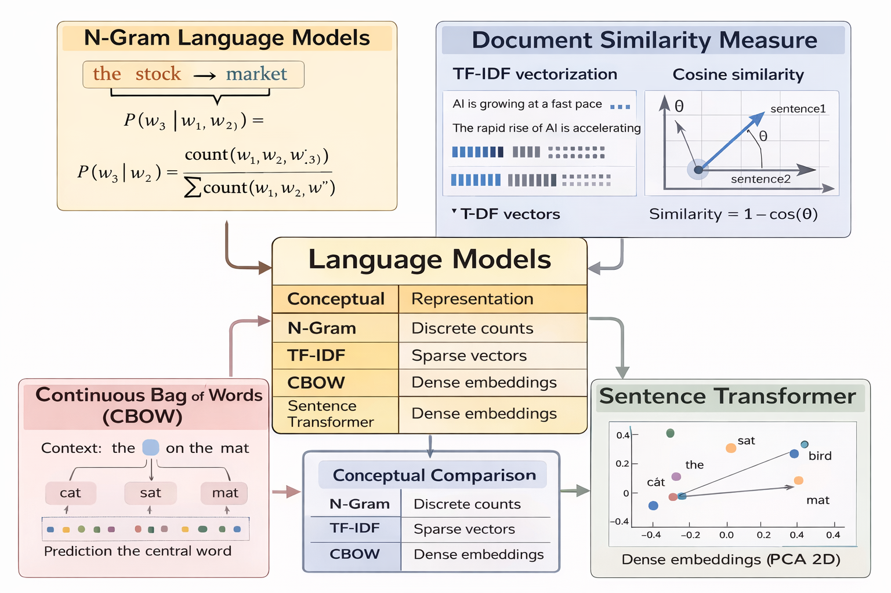

# Language Models

### N-Grams, Similarity Measures, and CBOW

## 1. Introduction

Language Models (LMs) are computational models designed to represent and reason about natural language. Their primary goal is to **capture patterns in text** in order to predict, compare, or understand linguistic sequences.
This lab explores three fundamental approaches to language modeling:

1. **N-Gram language models** based on probability and word co-occurrence
2. **Document and sentence similarity** using vector representations and cosine distance
3. **Continuous Bag-of-Words (CBOW)** as an early neural embedding model

Together, these approaches illustrate the evolution from **count-based statistical models** to **distributed neural representations** of language.

## 2. N-Gram Language Models

### 2.1 Concept of N-Grams

An N-Gram is a contiguous sequence of **N tokens** (words or symbols) extracted from a text corpus.

Examples:

* Unigram (N = 1): `market`
* Bigram (N = 2): `stock market`
* Trigram (N = 3): `the stock market`

In this lab, we focus on **Trigram models (N = 3)**.

### 2.2 Probabilistic Modeling with N-Grams

An N-Gram language model estimates the probability of a word given its preceding context.

For a trigram model:

$P(w_3 \mid w_1, w_2)$

This probability is computed using **maximum likelihood estimation (MLE)**:

$P(w_3 \mid w_1, w_2) =
\frac{\text{count}(w_1, w_2, w_3)}
{\sum_{w} \text{count}(w_1, w_2, w)}$

Where:

* The numerator counts how often the exact trigram appears
* The denominator counts how often the context `(w1, w2)` appears with any next word

### 2.3 Characteristics of N-Gram Models

**Advantages**

* Simple and interpretable
* Computationally efficient
* Useful for understanding language statistics

**Limitations**

* Cannot generalize to unseen contexts
* Suffer from data sparsity
* Do not capture semantic meaning

As a result, N-Gram models depend strictly on **previously observed examples** in the training corpus.

## 3. Similarity Measures Between Documents

Language modeling is not limited to prediction. Another important task is **measuring similarity** between texts.

### 3.1 Vector Space Representation

To compare documents or sentences, text is first converted into numerical vectors.

Two approaches are explored:

#### a) TF-IDF (Term Frequency – Inverse Document Frequency)

TF-IDF assigns importance to words based on:

* How frequent they are in a sentence
* How rare they are across documents

Each sentence becomes a sparse vector reflecting word importance.

### 3.2 Cosine Similarity

Once sentences are represented as vectors, similarity is measured using **cosine distance**:

$\text{Similarity} = 1 - \cos(\theta)$

Where cosine distance measures the angle between two vectors.

* Value close to 1 → high similarity
* Value close to 0 → low similarity

TF-IDF similarity relies heavily on **shared vocabulary** and does not capture semantic equivalence well.

### 3.3 Sentence Transformer Embeddings

To overcome TF-IDF limitations, we use **Sentence Transformers**, which produce dense embeddings learned by neural networks.

Key properties:

* Capture semantic meaning
* Handle synonyms and paraphrases
* Generalize beyond exact word overlap

As observed in the experiment, Sentence Transformers typically produce **higher similarity scores** for semantically equivalent sentences.

## 4. Continuous Bag-of-Words (CBOW)

### 4.1 CBOW Model Overview

CBOW is a neural language model that predicts a **target word** given its surrounding context.

Unlike N-Grams:

* CBOW does not store explicit probabilities
* It learns **word embeddings**, i.e., dense vector representations

### 4.2 Training Data Construction

Given a window size `n`, the model:

* Uses `n` words before and `n` words after the target word as context
* Learns to predict the central word

This transforms raw text into `(context, target)` training pairs.

### 4.3 Word Embeddings

Each word is mapped to a low-dimensional vector that captures its contextual usage.

Properties of embeddings:

* Words used in similar contexts have similar vectors
* Semantic relationships emerge automatically
* Representations are continuous rather than discrete counts

### 4.4 Visualization with PCA

To interpret embeddings, high-dimensional vectors are projected into 2D using **Principal Component Analysis (PCA)**.

This allows visualization of:

* Word clusters
* Contextual similarity
* Semantic groupings learned by the model

## 5. Conceptual Comparison of Approaches

| Model                | Representation   | Generalization | Semantic Awareness |
| -------------------- | ---------------- | -------------- | ------------------ |
| N-Gram               | Discrete counts  | No             | No                 |
| TF-IDF               | Sparse vectors   | Limited        | No                 |
| CBOW                 | Dense embeddings | Yes            | Partial            |
| Sentence Transformer | Dense embeddings | Strong         | Yes                |

## 6. Conclusion

This lab demonstrates the progression of language modeling techniques:

* **N-Grams** show how probability emerges from word co-occurrence
* **Similarity measures** introduce vector-based representations
* **CBOW** illustrates how neural models learn distributed representations
* **Sentence Transformers** highlight modern semantic modeling capabilities

Understanding these foundations is essential for grasping more advanced language models such as BERT and GPT, which build upon the same principles at a larger scale.